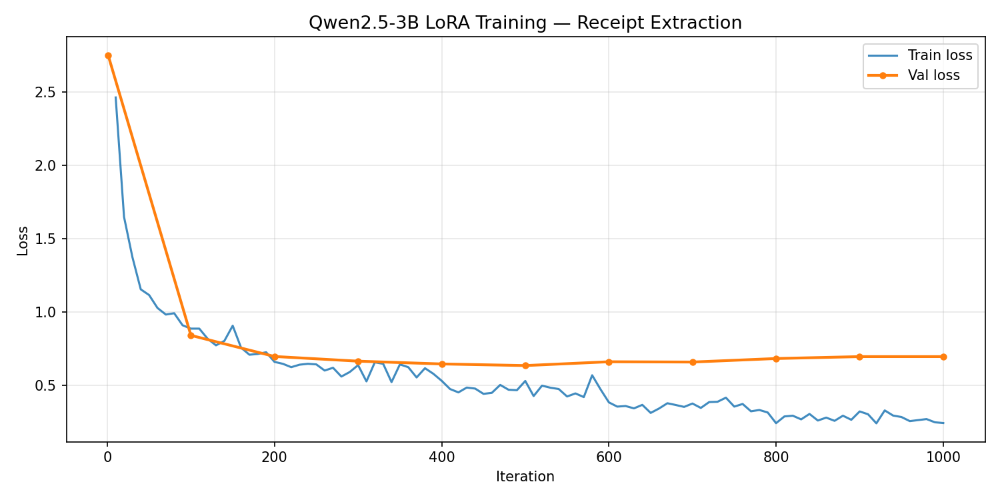

# Receipt Field Extraction — LoRA Fine-tuning (PEFT + TRL)

Fine-tuning **Qwen2.5-3B-Instruct** with QLoRA (4-bit + rank-8 LoRA) via HuggingFace PEFT + TRL SFTTrainer to extract structured fields from receipt OCR text. Runs on Google Colab T4 (15 GB VRAM).

**Task:** Given raw OCR text from a receipt, extract:
```json
{"company": "...", "date": "YYYY-MM-DD", "address": "...", "total": "0.00"}
```

---

## Results

| Field | Baseline | Fine-tuned | Delta |
|:------|--------:|----------:|------:|
| Company | 75.1% | 90.4% | +15.2% |
| Date | 53.3% | 98.0% | +44.7% |
| Address (exact) | 47.7% | 77.2% | +29.4% |
| Address (fuzzy) | 94.6% | 97.7% | +3.1% |
| Total | 89.3% | 98.0% | +8.6% |
| **All fields correct** | **32.5%** | **71.1%** | **+38.6%** |
| JSON parse failures | 0.5% | 0.0% | -0.5% |

All remaining failures after fine-tuning are partial matches — the model always outputs valid JSON and never hallucinates field names.



---

## Dataset

Two sources merged into a single dataset (~1950 examples):

| Source | Examples | Description |
|--------|----------|-------------|
| [rth/sroie-2019-v2](https://huggingface.co/datasets/rth/sroie-2019-v2) | 973 | Real Malaysian receipts (SROIE benchmark) |
| Synthetic (GPT-4o-mini) | ~970 | Indian receipts with OCR noise, 10 categories, 20 cities |

**Split:** 80% train / 10% valid / 10% test (stratified — test set guaranteed to have examples from both sources and all difficulty levels)

### Dataset Notes

- `darentang/sroie` raises `RuntimeError: Dataset scripts are no longer supported` with modern datasets library — use `rth/sroie-2019-v2` instead
- `rth/sroie-2019-v2` has an image column that crashes iteration without Pillow — call `remove_columns(["image"])` immediately after load
- SROIE fields are nested under `objects.entities`, not top-level

---

## Setup

```bash
git clone <repo>
cd receipt-extraction
pip install -r requirements.txt
```

Add your OpenAI key to a `.env` file (only needed for synthetic data generation):
```
OPENAI_API_KEY=sk-...
```

---

## Training on Google Colab T4

Open `colab_train.ipynb` in Colab (Runtime → T4 GPU), add your `HF_TOKEN` to Colab Secrets, and run all cells. The notebook handles data prep, training, evaluation, and pushing adapters to HuggingFace Hub.

---

## Training Pipeline (local / manual)

```bash
# 1. Generate synthetic Indian receipt data
python generate_synthetic.py

# 2. Download and process SROIE dataset
python prepare_sroie.py

# 3. Merge datasets and create train/valid/test splits
python merge_datasets.py

# 4. Fine-tune with QLoRA (requires NVIDIA GPU)
python train_peft.py

# 5. Evaluate baseline (before fine-tuning)
python baseline_eval.py

# 6. Evaluate fine-tuned model
python baseline_eval.py \
    --adapter-path ./adapters \
    --output ./results/finetuned_results.json

# 7. Compare results
python compare_results.py
```

All paths and hyperparameters are configured in `config.py` — edit that file, not the scripts.

---

## Model & Training Config

| Parameter | Value | Reason |
|-----------|-------|--------|
| Base model | Qwen2.5-3B-Instruct | Strong instruction following |
| Method | QLoRA (4-bit NF4 + LoRA) | Fits 3B model in T4's 15 GB VRAM |
| Rank | 8 | Sufficient for constrained extraction task, less overfitting risk |
| Alpha | 16 | Standard 2× rank scaling |
| LoRA layers | Last 16 of 36 | Covers output-side layers responsible for formatting |
| Effective batch size | 8 (4 per-device × 2 grad-accum) | Matches original MLX run |
| Epochs | 10 | ≈ 1000 iterations at batch 8 over ~800 training examples |
| Learning rate | 1e-4 cosine with 100-step warmup | Standard LoRA LR |
| Max seq length | 1024 | Receipt OCR + response fits comfortably |

---

## Model Weights

LoRA adapters are published on HuggingFace Hub: **[largetrader/qwen2.5-3b-receipt-extraction-lora](https://huggingface.co/largetrader/qwen2.5-3b-receipt-extraction-lora)**

---

## Project Structure

```
.
├── config.py                  # All variables — edit here
├── train_peft.py              # QLoRA training (PEFT + TRL, GPU)
├── colab_train.ipynb          # End-to-end Colab T4 notebook
├── baseline_eval.py           # Before/after evaluation (transformers + PEFT)
├── compare_results.py         # Results comparison + markdown output
├── demo.py                    # CLI inference demo
├── app.py                     # Gradio web UI (python app.py → localhost:7860)
├── generate_synthetic.py      # GPT-4o-mini synthetic data generation
├── prepare_sroie.py           # SROIE dataset processing
├── merge_datasets.py          # Dataset merging + stratified split
├── lora_config.yaml           # Legacy MLX-LM config (kept for reference)
├── requirements.txt
├── data/
│   ├── synthetic/             # Generated Indian receipt data
│   ├── sroie/                 # Processed SROIE data
│   └── final/mlx_format/      # train.jsonl, valid.jsonl, test.jsonl
├── adapters/                  # Saved PEFT adapter weights
└── results/
    ├── baseline_results.json
    ├── finetuned_results.json
    └── comparison.md
```

---

## Inference

```python
import torch
from transformers import AutoModelForCausalLM, AutoTokenizer
from peft import PeftModel

base = AutoModelForCausalLM.from_pretrained(
    "Qwen/Qwen2.5-3B-Instruct", torch_dtype=torch.float16, device_map="auto"
)
model = PeftModel.from_pretrained(base, "./adapters")
tokenizer = AutoTokenizer.from_pretrained("Qwen/Qwen2.5-3B-Instruct")

messages = [
    {"role": "system", "content": "You are a structured data extraction assistant. Given raw OCR text from a receipt, extract the fields as a JSON object with keys: company, date, address, total. date must be YYYY-MM-DD. total must be numeric string only. If a field is missing, use empty string."},
    {"role": "user", "content": "Extract structured fields from this receipt:\n\nSUPERMART\n123 MG Road, Bengaluru\nDate: 12/03/2024\nTotal: Rs.847.00"},
]

prompt = tokenizer.apply_chat_template(messages, tokenize=False, add_generation_prompt=True)
inputs = tokenizer(prompt, return_tensors="pt").to(model.device)
with torch.no_grad():
    out = model.generate(**inputs, max_new_tokens=200, do_sample=False)
print(tokenizer.decode(out[0][inputs.input_ids.shape[1]:], skip_special_tokens=True))
# {"company": "SUPERMART", "date": "2024-03-12", "address": "123 MG Road, Bengaluru", "total": "847.00"}
```

---

## Demo

```bash
# Run a hardcoded example (1 = easy, 2 = medium OCR noise, 3 = hard/messy)
python demo.py --example 1

# Extract from a text string
python demo.py --text "YOUR RECEIPT TEXT HERE"

# Interactive mode — paste text, end with Ctrl+D
python demo.py
```
